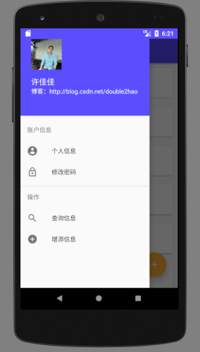

# SQLiteDB_Demo
网上很少有关于SQLite简单综合项目的简易APP,同时把自己所学的部分UI综合一下，希望
能给新手一些帮助。

注意:这里全都是使用Java实现的

## StudentInfoManager
* 模仿的项目链接:[Android应用开发-学生信息管理系统 - CSDN博客](http://blog.csdn.net/double2hao/article/details/52641074)

### 涉及知识点
* 包括SQLite的增删查找等功能。查找中加入了“模糊搜索”的功能。
* RecyclerView展示
* SharedPreference保存密码，以及判别是否是第一次安装APP。（如果是第一次就录入测试数据）
* 简单的Menu操作

### 项目截图

 

App体验地址:[StudentInfoManager](https://github.com/simplebam/SQLiteDB_Demo/releases/download/v1.0/StudentInfoManager-release_v1.0.apk)

## UseSQLiteDatabase
* 模仿的项目链接:[Android 数据存储 利用SQLiteDatabase实现简单的学生管理 - CSDN博客](http://blog.csdn.net/qwm8777411/article/details/46048905)

### 涉及知识点
我们要做一个简单的学生管理的demo，创建student.db，包括name,grade字段，实现增、删、改、查的功能；

### 项目截图

App体验地址:

## 模糊查询
* 模仿的项目链接:[实现城市列表的排序及模糊查询 - 简书](https://www.jianshu.com/p/0ea45116f475)

### 涉及知识点
* 对接口返回的数据进行排序
* 根据排序进行分组
* 对用户的输入进行智能匹配

### 项目截图

App体验地址:

## AbsolutePlan
* 模仿的项目链接:[WoodsHo/AbsolutePlan: AbsolutePlan](https://github.com/WoodsHo/AbsolutePlan)

### 项目介绍
* 这是一个只专注于帮助你记录、管理日常计划任务的工具类APP。
* APP功能专一、操作简单、界面优美，记录只保存在本地，不上传到服务端，不需要担心
  隐私泄露问题。

### 涉及知识点
* 对接口返回的数据进行排序
* 根据排序进行分组
* 对用户的输入进行智能匹配

### 项目截图

App体验地址: