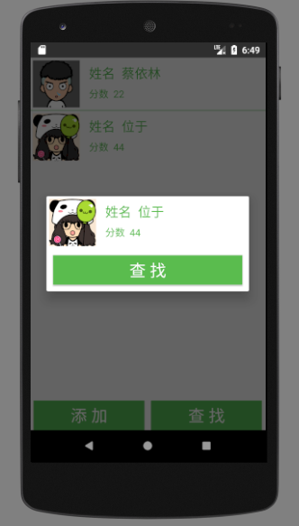

# SQLiteDB_Demo
网上很少有关于SQLite简单综合项目的简易APP,这里我打算把自己所学的以及网上找到的
资源集合起来，为开源出一份力。

注意:这里全都是使用Java实现的,kotlin朋友请绕道

## StudentInfoManager
* 模仿的项目链接:[Android应用开发-学生信息管理系统 - CSDN博客](http://blog.csdn.net/double2hao/article/details/52641074)

### 涉及知识点
* 包括SQLite的增删查找等功能。查找中加入了“模糊搜索”的功能。
* RecyclerView展示
* SharedPreference保存密码，以及判别是否是第一次安装APP。（如果是第一次就录入测试数据）
* 简单的Menu操作

### 项目截图

 

App体验地址:[StudentInfoManager](https://github.com/simplebam/SQLiteDB_Demo/releases/download/v1.0/StudentInfoManager-release_v1.0.apk)

## UseSQLiteDatabase
* 模仿的项目链接:[Android 数据存储 利用SQLiteDatabase实现简单的学生管理 - CSDN博客](http://blog.csdn.net/qwm8777411/article/details/46048905)

### 涉及知识点
我们要做一个简单的学生管理的demo，创建student.db，包括name,grade字段，实现增、删、改、查的功能；

### 项目截图

 

### 涉及知识点
* 对数据进行排序(主要利用comparable以及comparator接口知识)

App体验地址:[SQLiteDB_Demo](https://github.com/simplebam/SQLiteDB_Demo/releases/download/v2.0/UseSQLiteDatabase-release_V1.0.apk)

## QuickIndex-联系人快速索引demo
我以前学习自定义View的demo,可能看代码小伙伴会疲劳,免费视频链接(可下载):[自定义控件_初始化显示字母列表](http://www.gulixueyuan.com/course/124/task/1923/show)

### 项目截图

App体验地址:[QuickIndex](https://github.com/simplebam/SQLiteDB_Demo/releases/download/v3.0/QuickIndex-release.apk)

## 城市列表的排序及模糊查询demo
* 模仿的项目链接:[实现城市列表的排序及模糊查询 - 简书](https://www.jianshu.com/p/0ea45116f475)

### 涉及知识点
* 对接口返回的数据进行排序
* 根据排序进行分组
* 对用户的输入进行智能匹配

PS:其实这项目跟手机联系人功能是差不多的,主要利用人的名字拼音进行比较排序即可,

### 项目截图
 

App体验地址:[LocalSearchDemo](https://github.com/simplebam/SQLiteDB_Demo/releases/download/v3.1/LocalSearchDemo-release.apk)

## SleepHelper  
* 模仿的项目链接:[手把手教你从零开始做一个好看的 APP - 简书](https://www.jianshu.com/p/8d2d74d6046f)

### 项目介绍
既然要做一个 APP，那我们首先还是得把 APP 的功能都列出来，有了方向才能更好的努力，因为我想做的是一个专门给睡觉前用的 APP，所以我觉得应该有以下的这些功能

1、日记的增删改
2、显示一些有趣好玩的段子
3、瀑布流展示漂亮的妹子
4、保存日记的内容以及缓存妹子图片
虽然说需求不多，但是却要运用到网络、数据存储、图片缓存、UI 设计等内容，相信整个 APP 完成下来，必定能巩固我们的 Android 基础。

### 项目截图

