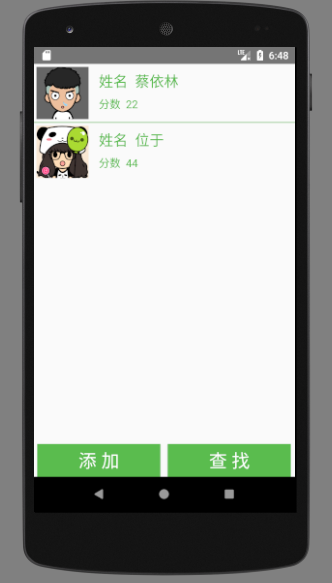
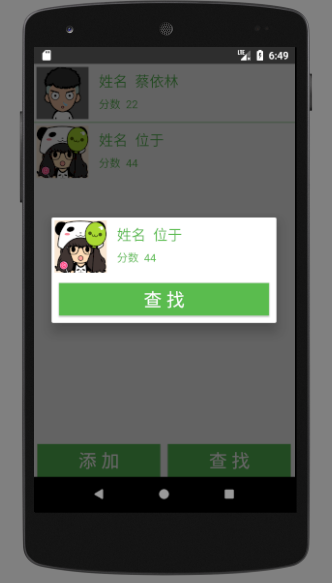

## UseSQLiteDatabase
* 模仿的项目链接:[Android 数据存储 利用SQLiteDatabase实现简单的学生管理](http://blog.csdn.net/qwm8777411/article/details/46048905)

### 功能
* 学生信息简单系统,实现增、删、改、查的功能；

### 项目截图

 

App体验地址:[StudentInfoManager](https://github.com/simplebam/SQLiteDB_Demo/releases/download/v1.0/StudentInfoManager-release_v1.0.apk)

### 项目中用到的知识
* 自定义View的AlertDialog：因为我们的查找对话框需要我们自定义视图，不熟悉的请看
  [Android常用实例—Alert Dialog的使用](http://blog.csdn.net/qwm8777411/article/details/45420451);
* 自定义Adapter的ListView：用来展示学生信息的ListView需要我们自定义Adapter将
  数据库中的数据填充到ListView。
* Toast用来提示消息：这个比较简单，用来提示一些信息，包括添加成功、删除成功等,
  [Android消息提示：AlertDialog、Toast、Notification的使用](http://blog.csdn.net/qwm8777411/article/details/45585603);
* Activity之间的信息传递：我们需要将学生信息从一个Activity传递到另一个Activity
  ，比如查看学生信息，或者添加成功后返回主界面，涉及到Intent和
  startActivityForResult()等的使用。
* SQLiteDatabase的基本使用：这也是我们这个练习的重点，不熟悉的建议先看上篇文章
  [Android 数据存储 如何搞定SQLite Database](http://blog.csdn.net/qwm8777411/article/details/46048831);

